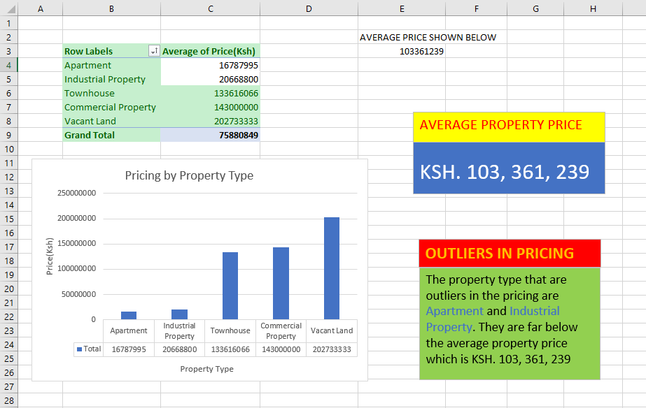
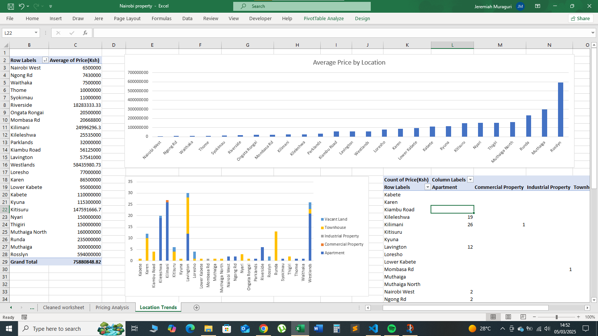
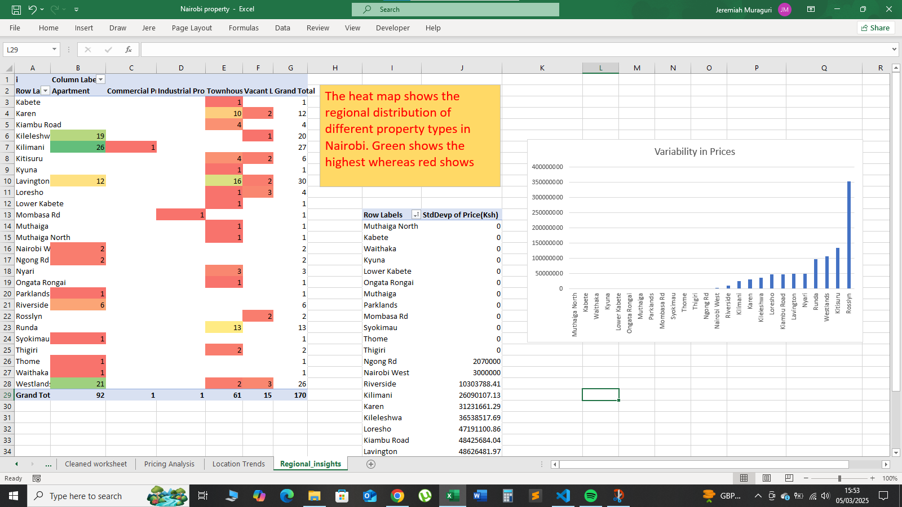
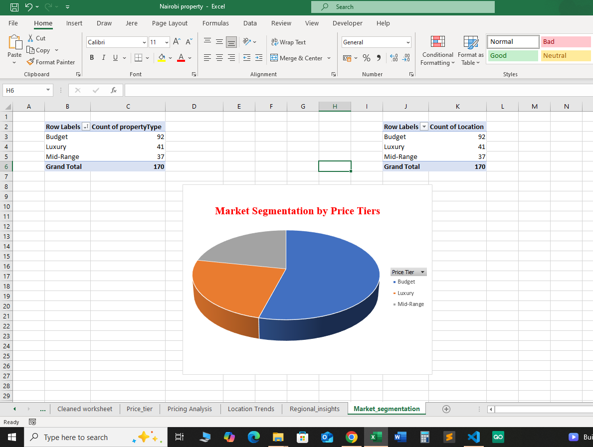
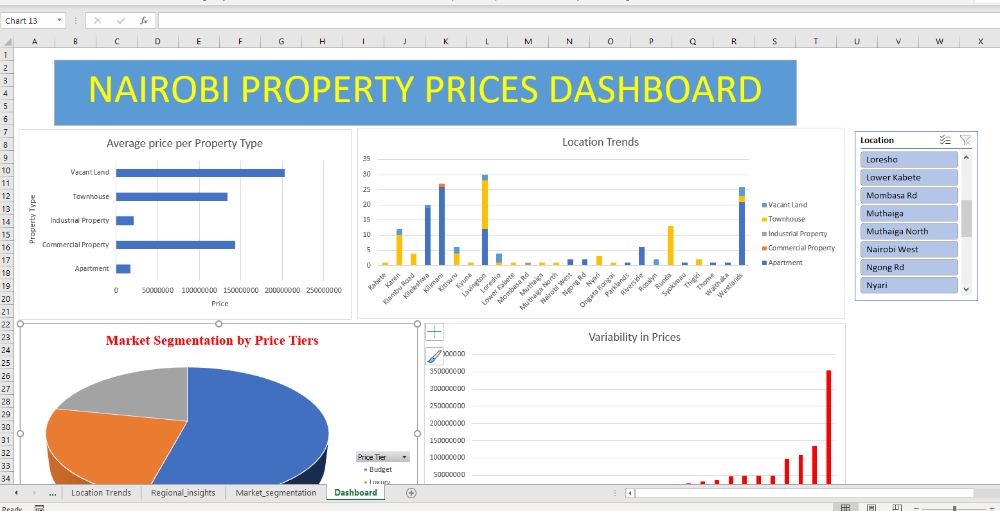
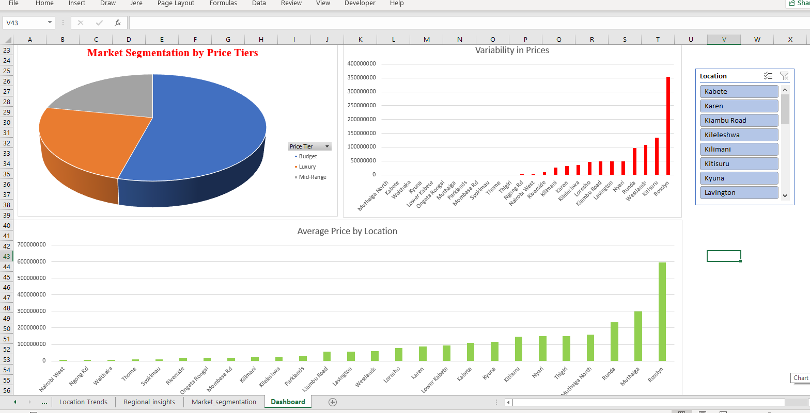

# Nairobi Property Prices Analysis

- This is a project that seeks to elaborate on the variations of property prices in Nairobi, Kenya which is a rising real estate powerhouse in the region.

- Some of the key areas this project will touch on include(but are not limited to); Pricing analysis, location trends, property features and market segmentation.

## Exploratory Data Analysis

- The dataset appears to have the following columns:

1. Price: Indicates the price of the property (e.g., "KSh 350,000,000").
2. PropertyType: Specifies the type of property (e.g., Townhouse, Vacant Land, Apartment).
3. Location: The location of the property (e.g., Runda, Karen, Westlands).
4. Bedroom: The number of bedrooms.
5. Bathroom: The number of bathrooms.
6. House size: The size of the house (e.g., in square meters).
7. Land size: The size of the land (e.g., in acres).

## Data Cleaning

 ### Steps taken during the data cleaning process:

   1. The Price column is inclusive of the currency denomination, that is, 'Ksh'. The first step is to copy the dataset we are going to clean and remain with the original as is. 
   - Using the SUBSTITUTE function to remove the 'Ksh' and the commas between the figures.
     
     - Insert an empty column B next to column A then type the following formula on cell B2:

       ```excel
       =SUBSTITUTE(A2, "KSh", "")
       ```

     - This will remove the spaces and the "KSh" denomination effectively. Flash fill to execute the formula along the whole column.

 #### Remove the spaces between the numbers.

   - Insert an empty column next to column A.

   - Write this formula on cell B2
   
   - Copy the whole column B and overwrite column A using the Paste Values feature to get rid of the formula and remain with values.

   - Delete the column B.

   - Next, convert the new Price column(B) from a general format to a number format 

       ```excel
       =VALUE(SUBSTITUTE(A2, " ", ""))
       ```
     

  2. Handle missing or inconsistent data

    - Update the bedroom, bathroom and House size columns to indicate 0 for rows that correspond with the propertyType of Vacant Land, Commercial Property and Industrial property.
    
#### For bedrooms

    - Insert a new column E beside the bedroom column 

    - Use the IF formula as follows and flash fill, then copy column E and Paste Values only onto the Bedroom column D and rename it to cleaned

    - Delete column E

       ```excel
       =IF(B2= "Vacant Land", 0, D2)
       ```
 
#### For bathroom:

    - Insert a new column F beside the bathroom column 

    - Use the IF formula as follows and flash fill, then copy column F and Paste Values only onto the Bathroom column E and rename it to Cleaned:
    
    - Delete column F

       ```excel
       =IF(B2= "Vacant Land", 0, E2)
       ```

#### For House size:

    - Insert a new column G beside the house size column 

    - Use the IF formula as follows and flash fill, then copy column G and Paste Values only onto the house size column F and rename it to Cleaned
    
    - Delete column G

       ```excel
        =IF(B2= "Vacant Land", 0, F2)
       ```

#### For Land Size
     
    - Update the land size column to indicate zero for rows that correspond with the 'propertyType' of Apartment.

    - On column H beside the land size column.

    - Use the IF formula as follows and flash fill, then copy column G and Paste Values only onto the land size column F and rename it cleaned

    - Delete column H.
        ```excel
       =IF(F2= "m²", 0, G2)
       ``` 

   3. Spelling mistakes

      - Correct cell G21 from 399 m²" to 399 m²
      - Correct cell B2 from Townhuse to Townhouse    

   4. The house size and land size contains measurements on each cell. The same Substitute formula mixed with trim is used here.
       - For the house size; 
       - Insert a column to the right of column F.
       - Write the following formula on cell G2:

           ```excel
           =VALUE(SUBSTITUTE(F6, "m²", ""))
           ```

       - Autofill the rest of the cells in column G.
       - Copy the column G and paste on column F to overwrite the column F with the new values without the measurements. Use Paste Values so as to not get an error.
       - Make sure to indicate the measurements in brackets beside the column header, house size.
          -Delete column G.
      
       - For the land size;
       - Write the following formula on cell H2;

           ```excel
           =VALUE(SUBSTITUTE(H2, "acres", ""))
           ```

        - Autofill the rest of the cells in column H.
        - Copy the column H and paste on column F to overwrite the column F with the new values without the measurements. Use Paste Values so as to not get an error.
        - Make sure to indicate the measurements in brackets beside the column header, land size.
        - Delete column H.

   5. Remove Duplicates
       - Highlight the whole dataset. (Ctrl + A)
       - Toggle to the Data pane on Excel.
       - Click on the remove duplicates option.
       - The Nairobi property dataset had 34 duplicate records removed.

   6. Create consistent formats.
      - Highlight columns with dates and numbers.
      - Choose the appropriate format on the Home pane; Home > Number format.


## Data Analysis

### 1. Pricing Analysis

 - This is a breakdown of how different property Types are priced all over Nairobi.
 - Create a new sheet and name it Pricing Analysis.
 - Drag the Property type column on to the rows pane.
 - Drag the price column all the way to the Values pane, set the field to average.
 - Insert a column chart to visualize the pricing analysis.
 - Calculate the Average of property prices using the formula below
   
   ```excel
   =AVERAGE(C4:C8)
   ```
- Use conditional formatting to highlight cells greater than the average.
- You easily notice that Apartment and Industrial Property property types are the outliers since their average price is far below the average property prices.



### 2. Location Trends

 - This is to show the highest and lowest average prices according to location.
 - Create a new sheet and name it location trends
 - Insert a pivot table on this sheet
 - Drag the location to rows and price to values and set it to average price.
 - Add a column chart to visualize it.
  
  #### Property Type Distribution by location

- Create a pivot table
- Drag location to rows
- Drag property type to columns
- Drag price to values. Set to count. 



### 3. Regional Insights

- Create a new sheet named Regional_insights and add a pivot table.
- Drag the location to rows.
- Drag the propertyType to columns.
- Drag the propertyType to values and set to count.
- Visualize using a heatmap (conditional formatting)

  #### Variability in Prices along locations

  - Create a pivot table.
  - Drag location to rows.
  - Drag price to values and set to standard deviation.
  - Use a column chart to display variability



### 4. Market Segmentation

- This aims at categorizing properties by price tiers.

- Duplicate the Cleaned Worksheet(Sheet2), and name the new sheet Price Tier.

- Create a new column using the IF function below

```Excel
=IF(A2<=30000000, "Budget", IF(A2<=100000000, "Mid-Range", "Luxury"))
```

-This separates the prices into three tiers of Budget, Mid-Range and Luxury.

- Next, on the new Cleaned worksheet, create a pivot table.

- On the rows window, drag the price tier column

- On the values window propertyType or Location.

- Insert a pie chart to visualize how the market is segmented. 



- According to the data provided in the file above, the data driven conclusion of the list in descending order is;
    i. Budget
    ii. Luxury
    iii. Mid-Range

- Market Segmentation is essential in providing data driven insights to show potential stakeholders that would want to invest in the Nairobi real estate industry.

## Data Visualization

- The different charts generated from the pivot tables are to be compiled on a new sheet named "Dashboard". For this circumstance we separated the screeenshot image into part 1 and 2 so that it could fit well.

- Insert a slicer for the location on the market segmentation and average pricing.

- The dashboard will appear as follows;





## Insights/ Data-driven conclusions

- These are the valid conclusions drawn from the data analysis conducted above;
    
#### I. High End neighbourhoods dominate price

-Townhouses in Runda and Muthaiga lead the market, with average listing prices exceeding Ksh. 200 million.

- Apartments in Westlands and Kilimani show premium pricing, averaging above Ksh. 15 million.

#### II. Vacant Land is surprisingly expensive

- Despite lacking bedrooms and house structures, vacant land in Westlands and Karen ranks among the most expensive listings, often surpassing Ksh. 100 million. 

- This indicates location and land potential are strong value drivers.

#### III. Property Types are Unevenly Distributed

- Apartments dominate the listing volume, followed by townhouses and vacant land.

- Few listings for mansionettes, indicating limited supply or exclusivity.

#### IV. Market Segmentation Reveals Three Distinct Tiers

- Budget Segment (< Kshs 30M): Primarily made up of apartments in densely populated areas like South B, Embakasi, and Roysambu. These are ideal for first-time buyers or rental investors targeting the middle-income market.

- Mid-Range Segment (Kshs 30M - 100M): Dominated by townhouses and maisonettes in growing suburbs like Lavington, Kileleshwa, and Kilimani. These attract professionals and upper-middle-class families.

- Luxury Segment (> Kshs 100M): Includes vacant land and large standalone homes in Karen, Runda, and Muthaiga. These properties are aimed at high-net-worth individuals and developers looking for premium investments.

- Note: This segmentation helps stakeholders (buyers, investors, and real estate developers) target the right market according to budget and property type.


